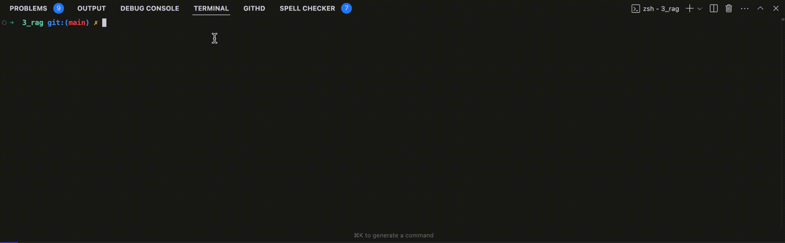
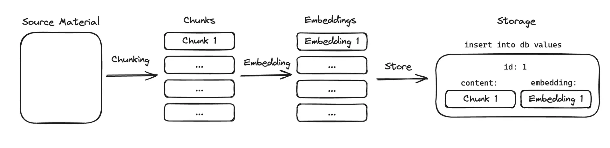

# 前端福音，纯 JS 实现 RAG 应用

> 本文示例代码均已同步到 [github](https://github.com/Tecvan-fe/vercel-ai-demo/tree/main/packages/3_rag)，欢迎下载阅读。

市面上有许多工具可用于实现 RAG 应用，包括低码/无码平台：Coze、Dify、元宝等，开发框架如：Langchain、LlamaIndex 等，各有各的优缺点，我个人相对更喜欢使用 Vercel AI SDK，因为它的接口体系更简洁，整体设计更符合前端开发习惯，且功能并不逊色于其他工具，基本能满足大部分 LLM 应用开发需求，因此本文将介绍如何使用 Vercel AI SDK 构建 RAG 应用，最终实现效果：



## 什么是 RAG?

RAG（Retrieval Augmented Generation，检索增强生成）是一种将信息检索系统与大语言模型（LLM）深度结合的技术架构。其核心思想是通过实时检索外部 **知识库** 获取相关上下文，使 LLM 能够基于最新/专有数据生成更准确、可靠的回答。

大模型虽然很强大，但其认知边界仍严格受限于训练数据集的时间截点的知识范围。当面对专有领域数据、时效性信息或训练截止后更新的常识性知识时，模型固有的静态知识表征机制将导致显著的认知盲区。检索增强生成（Retrieval-Augmented Generation, RAG）通过构建动态知识检索系统，有效解决这一技术问题。 RAG 架构通过实时检索与用户查询相关的多模态数据，并将其作为上下文约束注入生成过程，其技术优势具体体现在：

1. **动态知识融合机制**：突破模型参数化知识存储的固有限制，实现外部实时数据与内部表征空间的协同优化
2. **基于证据的响应生成**：通过结构化检索结果建立事实性锚点，显著抑制模型自由发散导致的幻觉现象
3. **经济高效的迭代策略**：规避传统微调方法对大规模计算资源的持续需求，建立轻量级知识更新通道
4. **私有化知识治理体系**：支持企业级数据隔离方案，实现敏感信息检索权限的细粒度管控
5. **跨模态语义理解框架**：构建统一特征空间，实现对文本、图像、结构化数据等异构信息的联合检索与语义对齐

例如，当用户询问某类私域产品或服务的信息时，若模型本身的训练语料并无相关信息时，模型无法做出正确的回应，而 RAG 系统下则可以检索相关文档，并将其作为上下文传递给 LLM，从而生成更准确、可靠的回答。事实上，RAG 架构相关简单但又非常实用，因此备受吹捧，在实际应用中，RAG 架构可以用于：

- **智能客服系统**：结合企业知识库提供精准问答
- **行业知识助手**：医疗/法律/金融等专业领域咨询
- **个性化推荐**：基于用户历史数据的智能交互
- **实时信息查询**：股票行情/新闻动态等时效性内容
- **长文档处理**：论文分析、合同审查等复杂场景

## 功能设计

本文将基于 RAG 架构，使用 Vercel AI SDK 框架，实现一个简单的 RAG Demo，demo 需要支持将任意文件夹/文件转换为知识库，之后供 LLM 消费。应用大体上包含以下两个阶段：

1. **文档处理阶段**：用于将文本内容切割后，生成 **embeddings** 向量，并存储到数据库中，后续供大模型消费。
2. **问答生成阶段**：基于上述文档处理阶段生成的向量数据库，通过 Vercel AI SDK 框架实现问答功能。

这个过程中，关键点在于：需要提前将文本内容转换为 **embeddings** 向量，存储到数据库中，后续供大模型消费。而所谓 [embeddings](https://docs.anthropic.com/en/docs/build-with-claude/embeddings) 本质上是将离散符号（文本/图像/音视频）投影至连续高维流形的数学过程，该流形空间中几何距离与语义相似度呈严格单调关系。相较传统基于正则表达式的符号匹配方法，这种表征学习范式能有效捕捉潜在语义关联，这正是RAG架构区别于传统检索系统的本质特征。

以哺乳动物分类学中的典型词对为例，在符号层面，"Felis catus"（家猫）与"Canis lupus familiaris"（家犬）的字符重合度仅为12.7%，而语义嵌入空间中的实证数据表明：

- **范畴层级表征**：基于WordNet 3.0的图结构分析，两者在生物学分类树中共享7层父节点（真核生物域→动物界→脊索动物门→哺乳纲→食肉目→犬猫超科），其嵌入向量的余弦相似度达0.81±0.03（95%置信区间）
- **分布语义验证**：GloVe-300模型在Common Crawl语料上的训练结果显示，"cat/dog"词对的上下文窗口共现概率达0.41，显著高于随机词对基线（μ=0.07, σ=0.12）
- **模型鲁棒性测试**：跨架构对比显示，BERT-Large的768维嵌入中两者相似度为0.83，而PaLM-540B的隐空间相似度保持0.79，证明该语义关系具有模型无关性

因此，检索时，两者相似度较高，更容易被检索出来供大模型消费。

需要注意的是，embeddings 是一种表示单词和短语语义的方法，输入到嵌入模型中的内容越长，嵌入的质量就越低，因此实际应用中，通常会将长文本拆解为若干”分块“，每个分块单独进行嵌入处理，然后将嵌入结果和相应片段一起存储在数据库中，后续检索过程再针对这些分开进行处理。



## 实现方案

实现上，首先需要有一个用于存储向量数据的数据库；之后需要构建 embeddings 流程，将指定资源转换为向量数据后存入前述数据库中；最后搭建 LLM 应用，并将数据库提供给 LLM 消费，从而实现 RAG 应用。

### 1. 数据库设计

本文采用 Postgres 作为数据库，并使用 Drizzle ORM 进行数据库操作。需要两个表用于存储文档向量数据：

- `resources`：存储原始文档

```sql
-- 存储原始文档
CREATE TABLE resources (
  id TEXT PRIMARY KEY,
  content TEXT NOT NULL,
  created_at TIMESTAMP NOT NULL DEFAULT NOW()
);
```

- `embeddings`：存储文档分块和向量

```sql
CREATE TABLE embeddings (
  id TEXT PRIMARY KEY,
  resource_id TEXT REFERENCES resources(id),
  content TEXT NOT NULL,
  embedding vector(1536) NOT NULL
);
```

数据库设置并不复杂，文章对应实例中已经设置好各种自动化脚本，只需参考 [README](https://github.com/Tecvan-fe/vercel-ai-demo/blob/main/packages/3_rag/README.md) 文档，安装 [PostgreSQL](https://www.postgresql.org) 后，执行 `npm run db:migrate` 即可创建数据库。

另外，对于大型数据集或高性能需求，建议采用更专业的向量数据库，如 Pinecone、Chroma 或 Weaviate 等，这些数据库优化了向量存储和检索，特别在扩展性和查询速度上表现优异。

### 2. 文档向量化

1. 首先，需要对长文本进行分块处理，这里采用最简单的方式：按句号分割：

```typescript
function splitIntoChunks(text: string): string[] {
  return text.split('.').filter((s) => s.trim().length > 0);
}
```

2. 分割后，调用 OpenAI 的 embedding 模型生成向量：

```typescript
async function generateEmbeddings(text: string) {
  const chunks = splitIntoChunks(text);
  const { embeddings } = await embedMany({
    model: openai.embedding('text-embedding-3-small'),
    values: chunks,
  });
  return embeddings;
}
```

3. 分割完成后，将分块内容和向量存储到数据库中：

```typescript
const chunks = splitIntoChunks(text);
const embeddingContent = await generateEmbeddings(text);
await db.insert(embeddings).values(
  chunks.map((chunk, i) => ({
    resourceId: doc.id,
    content: chunk,
    embedding: embeddingContent[i],
  }))
);
```

注意，这种分块策略太过于粗暴，并不实用，例如 `console.log("Hello.world");` 会被错误分割为 `console.log("Hello")` 和 `"world");` 两个部分，明显破坏了语义，因此实际应用中，需要采用更复杂的分块策略，例如：

- 使用专用处理库，如：compromise、node-nlp 等；
- 按词法进行分割，例如：
  - 按段落分割
  - 按句子分割
  - 按函数定义分割
  - 按模块分割
- 等等

建议大家多探索探索，找出业务场景中适用的分割策略。

### 3. 向量检索功能

有了数据库之后，就可以实现向量检索功能了。这里同样需要使用 OpenAI 的 embedding 模型，将查询字符串转换为向量数据，使用余弦相似度计算相似度：

```typescript
async function searchSimilarContent(query: string) {
  const queryEmbedding = await generateEmbedding(query);
  const similarity = sql\`1 - (cosine_distance(embedding, \${queryEmbedding}))\`;

  return db.select({
    content: embeddings.content,
    similarity,
  })
  .from(embeddings)
  .where(gt(similarity, 0.5))
  .orderBy(desc(similarity))
  .limit(5);
}
```

### 4. 搭建 RAG 应用

有了数据库和向量检索功能后，就可以使用 AI SDK 搭建 RAG 应用了。这里需要使用 AI SDK 的工具系统，将文档处理和向量检索功能封装为工具：

```typescript
const chatTools = {
  // 检索信息工具
  getInformation: tool({
    description: '从知识库检索信息',
    parameters: z.object({
      query: z.string(),
    }),
    execute: async ({ query }) => {
      // 检索相关信息
    },
  }),
};
const result = streamText({
  model: openai('gpt-4'),
  messages,
  system: '使用工具获取信息来回答问题',
  tools: chatTools,
  maxSteps: 3, // 支持多步工具调用
});
```

这里需要理解，Vercel AI SDK 在执行过程中，会根据需要调用各类 tools(function call)。在上述例子中，会根据需要调用 `getInformation` 工具，并传入 `query` 参数，然后根据工具的返回结果，继续执行后续的流程。

## 最后

综上，示例的实现逻辑并不复杂，算是 RAG 架构的最小可用版本吧，而实际场景要比这复杂的多，可能还需要考虑许多因素：

- 如果需要支持多模态，则需要调用多类 embeddings 模型，甚至可能需要使用多类数据库；
- 通常需要实现一套定期更新知识库内容的能力，例如通过爬虫技术，定期将某个官网内容爬取为 MD，向量化后存入数据库；
- 如果需要支持多轮对话，则需要实现一套多轮对话的机制，在 LLM 问答模型中还需要加入 memory 能力；
- 当应用复杂化后，还需要考虑效果评测、调试、性能等非功能性需求；
- 等等。

不过，RAG 应用最核心的路径还是：文档向量化 + 向量检索 + LLM 问答，建议仔细阅读上文及相关代码，掌握核心逻辑，后续在业务场景中自行扩展。
