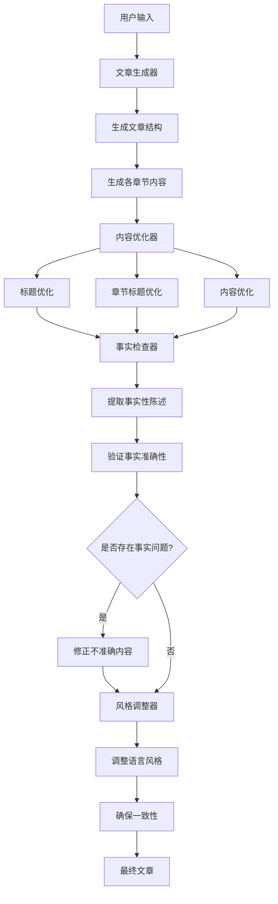

# Writer Package

## 概述

Writer 包是一个基于 AI 的文章生成和优化工具，它利用先进的语言模型来创建、优化和验证文章内容。该工具可以生成高质量的文章，并确保内容的准确性、可读性和吸引力。

## 核心功能

1. **文章生成**：根据用户提供的主题和要求，自动生成结构化的文章内容
2. **内容优化**：提升文章的可读性、吸引力和专业性
3. **事实检查**：验证文章中的事实性陈述，确保内容准确无误
4. **风格调整**：根据用户指定的风格要求调整文章语调和表达方式

## 技术架构

Writer 包主要由以下几个核心模块组成：

### 1. 文章生成器 (Article Generator)

负责根据用户输入的主题和要求，生成完整的文章结构和内容。

### 2. 内容优化器 (Content Optimizer)

对生成的文章进行优化，提高可读性和吸引力，包括：

- 标题优化
- 章节标题优化
- 内容流畅度和结构优化

### 3. 事实检查器 (Fact Checker)

验证文章中的事实性陈述，确保内容准确无误：

- 提取需要验证的事实性陈述
- 验证每个陈述的准确性
- 修正不准确的内容

### 4. 风格调整器 (Style Adjuster)

根据用户指定的风格要求，调整文章的语调和表达方式。

## 逻辑流程图



## 详细模块说明

### 文章生成器 (Article Generator)

文章生成器是整个系统的起点，它接收用户的输入（如主题、关键词、目标受众等），并生成初始的文章结构和内容。

**主要功能**：

- 分析用户输入，确定文章主题和方向
- 创建文章大纲和章节结构
- 为每个章节生成详细内容
- 生成引言和结论

### 内容优化器 (Content Optimizer)

内容优化器负责提升文章的质量，使其更具可读性和吸引力。

**主要功能**：

- 优化文章标题，使其更具吸引力
- 优化章节标题，使其更清晰、更具描述性
- 改进段落结构和逻辑流程
- 增强语言表达的清晰度和吸引力
- 确保内容与标题紧密相关
- 添加适当的过渡词，使文章更流畅

### 事实检查器 (Fact Checker)

事实检查器确保文章中的事实性陈述准确无误，提高文章的可信度。

**主要功能**：

- 从文章中提取需要验证的事实性陈述
- 验证每个陈述的准确性
- 识别不准确的内容并提供修正
- 生成修正后的文章内容

### 风格调整器 (Style Adjuster)

风格调整器根据用户指定的风格要求，调整文章的语调和表达方式。

**主要功能**：

- 根据目标风格调整语言表达
- 确保整篇文章风格一致
- 调整专业术语的使用频率和方式
- 优化句子结构和长度

## 设计亮点

Writer 包的设计包含了多个精妙之处，这些设计使得生成的内容质量更高、更可靠：

### 1. 多阶段优化机制

系统采用了多阶段优化机制，而不是一次性生成最终内容。这种设计有以下优势：

- **专注分离**：每个阶段专注于内容的不同方面（结构、表达、事实、风格），使得每个优化步骤更加精确
- **渐进式改进**：通过多次迭代，内容质量逐步提升，避免了一步到位的局限性
- **错误隔离**：各阶段的错误不会相互影响，提高了整体系统的稳定性

### 2. 事实检查与自我修正

事实检查器的设计特别精妙：

- **自动提取关键事实**：系统能够自动识别需要验证的事实性陈述，无需人工标注
- **独立验证机制**：每个事实陈述都经过独立验证，提高了准确性
- **自我修正能力**：当发现不准确信息时，系统能够自动提供修正，并将修正无缝融入原文
- **置信度评估**：对每个事实验证结果都附带置信度评分，使得系统能够区分确定性和不确定性信息

### 3. 错误恢复与重试机制

系统实现了强大的错误恢复机制：

- **retryWrapper 函数**：关键操作都通过 retryWrapper 包装，在遇到临时错误时自动重试
- **优雅降级**：即使某些优化步骤失败，系统仍能返回部分优化的内容，而不是完全失败
- **详细日志记录**：每个步骤都有详细的日志记录，便于调试和问题定位

### 4. 模块化与可扩展设计

代码采用高度模块化的设计：

- **功能分离**：每个功能（生成、优化、事实检查、风格调整）都是独立模块
- **模型抽象**：通过 createModel 和 createDeepseekModel 函数抽象了模型调用，便于切换不同的 AI 模型
- **统一接口**：各模块遵循统一的接口约定，便于组合和扩展

### 5. 智能提示工程

系统在与 AI 模型交互时采用了精心设计的提示工程：

- **角色定位**：为每个任务明确定义了 AI 的角色（如"专业的事实核查专家"、"专业的文章内容优化专家"）
- **任务分解**：将复杂任务分解为明确的子任务，使 AI 能够更好地理解和执行
- **结构化输出**：使用 zod 模式定义结构化输出，确保 AI 返回的内容符合预期格式
- **上下文传递**：在多步骤处理中，有效地传递上下文信息，保持处理的连贯性

这些设计亮点共同确保了 Writer 包能够生成高质量、准确、风格一致的文章内容，同时保持了系统的可靠性和可扩展性。

## 使用示例

```typescript
import { articleGenerator } from '@demo/writer';

async function generateArticle() {
  const article = await articleGenerator({
    topic: '人工智能在医疗领域的应用',
    style: '专业、信息丰富',
    targetAudience: '医疗专业人士',
    keyPoints: ['AI 在诊断中的应用', '医学影像分析', '药物研发', '伦理考量'],
  });

  console.log(article);
}

generateArticle();
```

## 技术依赖

- AI 模型：使用 OpenAI 和 Deepseek 的语言模型
- 工具库：ai-sdk、zod 等
- 辅助功能：日志记录、错误重试等

## 未来计划

1. 支持更多语言模型和提供商
2. 增强多语言支持
3. 添加更多专业领域的知识库
4. 提供更细粒度的风格控制
5. 集成更多的事实验证来源
